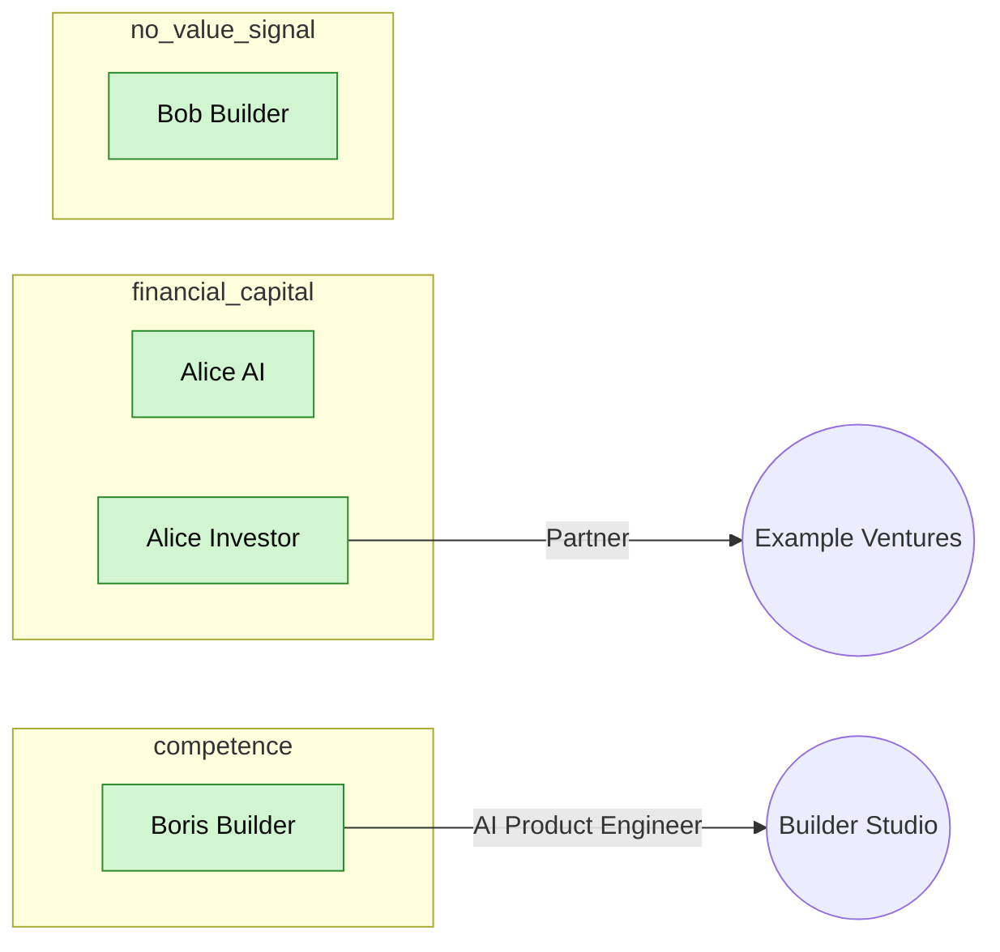

# Network Chief Dashboard (30-day window)
_Captured at <generated by CI> • first snapshot_

## 1. Network breadth
- **Total contacts**: 4
- **New in last 30d**: 4
- **Identity coverage**: email 50.0% • linkedin 50.0% • twitter 50.0% • phone 0.0%
- **Source contribution** (people with at least one fact from each source):
  - `linkedin_export` → 2
  - `gmail_json` → 2
  - `x_export` → 1

## 2. Engagement cadence
- **Touches**: 7d 3 • 30d 4 • 90d 4
- **Active people (≥1 touch)**: 30d 4 (100.0%) • 90d 4 (100.0%)
- **Reciprocity (90d)**: incoming 1 • outgoing 2 → ratio 0.5 (incoming÷outgoing)
- **Stale-but-valuable** (value ≥60 AND no touch in 90d): **0**

## 3. Action pipeline (last 30d)
- **Drafts**: created 0 • approved 0 • rejected 0
- **Approval rate**: 0.0%
- **Sync runs**:
  - `gmail_json` (ok) ×1 — last 2026-05-01T21:10:02Z
  - `x_export` (ok) ×1 — last 2026-05-01T21:10:02Z
  - `linkedin_connections` (ok) ×1 — last 2026-05-01T21:10:01Z

## 4. Value coverage
- **financial_capital** (score ≥60): 2
- **competence** (score ≥60): 2
- **specific_knowledge** (score ≥60): 2
- **time_saving** (score ≥60): 1
- **Median value score**: 79

## 5. Goal coverage
- _Reactivate investor network_ (weekly): 2 matching contacts

## Network graph (top 40 by value-score)

Legend: 🟢 touched in 30d • 🟡 touched in 31–90d • ⚪ stale (>90d, low value) • 🔴 stale-but-valuable (≥60 value-score, >90d).

## 6. How to read this
- **Network breadth** answers Reid Hoffman's *I+1/I+2* question: are you adding new nodes, and do you have enough reach surface (channels) to reach them?
- **Cadence** is Keith Ferrazzi's *3-touch rule* and CMX's *active vs lurking* split — if `pct_active_30d` is below ~10%, the network is going cold.
- **Reciprocity** is Adam Grant's *givers vs takers* signal. Healthy operators run incoming÷outgoing around 0.7–1.3; a ratio <<1 over 90d means you're broadcasting more than you're receiving — investigate why.
- **Stale-but-valuable** is the single most actionable number on this dashboard. Each one is a high-value contact going cold. The weekly job is to drive this number down — use `prepare-gmail-keepalive`, then approve drafts.
- **Approval rate** measures whether the agent's drafts match your judgment. If it drifts below 50%, the keyword/value heuristics need tuning (or your goals need refreshing).
